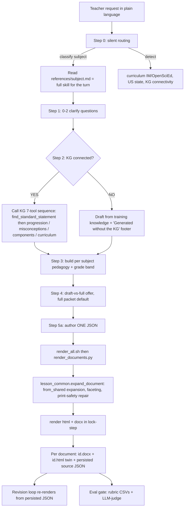

# k12-teacher-skills — Engine Map

A study of what Anthropic actually shipped in `k12-teacher-skills` (v0.6.0, Apache-2.0,
co-developed Anthropic PBC + Learning Commons). Produced from a full read of the forked
repo. This is the "understand everything they shipped" reference; no upstream changes are
made until it is understood.

The plugin ships **two education skills** over **one shared render engine**, with a
**rubric-based eval framework** as the quality half of a QA loop, wrapped in
**plugin/marketplace/licensing scaffolding**, and grounded (optionally) on the
**Learning Commons Knowledge Graph** — an external Claude-for-Teachers connector that is
*not* bundled in the repo.

---

## 1. Subsystems

| Slice | Role |
|---|---|
| `k12-lesson-planning` | Natural-language request → standards-aligned multi-document package (lesson plan + student materials + observation template; optional source packet / hint cards). Explicitly **not** grading, quizzes, rubrics, or differentiation. |
| `k12-lesson-differentiation` | One existing lesson → 1 teacher plan + 3 tiered worksheets (below/at/above), Tomlinson framework, "invisible modifications" (same standard/context/task, only supports differ). |
| Shared render pipeline | One material-source JSON → `.docx` deliverable + always-on `.html` twin, per document. **5 of 6 script files are byte-identical across the two skills** (only `render_all.sh` differs). |
| Evals framework | CSV rubrics (P/R/O/M buckets: Pedagogy / Rigor / Output / Model-scaffolding) + an LLM-as-judge methodology. **No runnable grader ships.** |
| Packaging / licensing | Single-plugin marketplace; nine bundled third-party ed-tech MCP connectors (unused by the skills); Apache-2.0 + NOTICE + Common Core attribution + CLA machinery inherited verbatim from Anthropic. |
| Standards dependency | The Learning Commons KG (7 tools, 3 data classes) and its public-standards replacement path. |

---

## 2. Data flow — teacher request → rendered document

**The engine's core trick (anti-drift):** everything a lesson needs is written once into a
`shared` content registry; each `documents[]` page pulls repeated content with
`{"type":"from_shared","key":…}`. Tiers and audience-variant pages *structurally cannot*
say different things about the same task. Faceted values `{teacher, student, stimulus}`
render audience-appropriately — a null `student` facet prints nothing. A substantial
**print-safety repair pass** in `lesson_common.py` fixes classes of malformed-JSON model
output that survive prompt instructions.

**Quality contract:** the eval rubrics are the executable spec. Planning is scored
`shared.csv` (~33 criteria) + a per-subject CSV; differentiation is scored
`differentiation.csv` (~27, tier-aware) + `clarifying_question.csv`. P/R/O criteria judge
the **documents**; the entire **M bucket judges the chat transcript**.

---

## 3. The Learning Commons dependency (what this project replaces)

- **One point of contact: Step 2 ("Ground in standards").** Step 0.3 probes whether
  `find_standard_statement` resolves. Connected → run the per-subject KG call sequence
  (not calling = documented "critical failure"). Absent → training-knowledge draft +
  disclaimer footer. Every subject file already ships a first-class KG-absent branch.
- **It is NOT in `plugin/.mcp.json`.** That file wires nine *unrelated* third-party servers
  (ASSISTments, Brisk, Canva, Coteach, Diffit, Eedi, MagicSchool, Snorkl, TeachFX) the
  skills never call. The KG is injected separately by the Claude-for-Teachers runtime.
  **As shipped, an installed plugin silently runs the degraded fallback.**

### The 7-tool KG surface (the contract to reproduce)

1. `find_standard_statement`
2. `find_standards_progression_from_standard`
3. `find_misconceptions_for_standard`
4. `find_learning_components_from_standard`
5. `find_curriculum_lessons`
6. `find_materials_for_lesson`
7. `list_standards_for_mathematical_practice`

### Three data classes the KG supplies

- **Class A — standards corpus:** verbatim statement text + `code` + `caseIdentifierUUID`
  join key + substandards (all subjects, 50 states). **Fully public-substitutable.**
- **Class B — progression / misconception / learning-component metadata**, keyed on the
  UUID (**math-only for progressions**; patchy/optional elsewhere). **Partially
  substitutable; skills already treat most as optional.**
- **Class C — IM / OpenSciEd HQIM curriculum structure** (strict copyright guardrail).
  Public (CC BY) but highest effort; safe to defer.

**The UUID is the spine.** The whole Class-B call graph joins on one stable per-standard
identifier, and `shared.standard_code` / `standard_text` are the contract that backs both a
standards-wiki view and the generator — so one store can feed both without drift.

---

## 4. Standards-access verdict

**Public standards CAN substitute for the KG — for both a wiki and for feeding the skills —
and we should do this rather than touch the KG's data at all.**

- **Class A:** fully substitutable. CCSS is public-licensed (the repo's own NOTICE cites
  thecorestandards.org/public-license); NGSS is free-to-use with attribution; state DOE
  standards are government works. The KG's real value is normalization + stable UUIDs —
  engineering, not proprietary content.
- **Class B:** progressions are public for the only subject the KG serves them for — math
  (achievethecore.org CCSS-Math coherence map). Misconceptions are patchy but optional.
- **Class C:** public (CC BY) but defer; skills degrade cleanly without it.

**Legal line.** *Mining the KG* is high-risk and self-defeating: it is a connector gated to
verified educators for in-product use (scraping likely violates ToS), its curated
selection/arrangement can attract compilation/database rights, and it is an access path we
cannot ship to non-Teachers users. *Aggregating public standards ourselves* is low-risk —
obligations are attribution, honoring each source's license notice, and not implying
endorsement. Bottom line: **do not touch the KG's data; rebuild Class A/B from public
sources and wire them into the connector-absent seam the skills already expose.**

> **Correction (2026-07-22, verified).** "Do not touch the KG's data" applies to the *gated
> API/connector* only. Learning Commons *separately publishes the entire graph* as an
> openly-licensed export (CC BY 4.0 / CC0) intended for reuse, including commercial. We
> therefore **adopt that published export** (with attribution) rather than rebuild Class A/B
> from scratch. See `sourcing-verdict.md` for the verified build-vs-adopt decision.

---

## 5. Structural facts that shape anything built on this

- **Two skills, one renderer, duplicated twice** — every renderer fix is currently a
  four-place synchronized edit, and `render_all.sh` has already drifted.
- **The model never reads the renderer** (SKILL.md forbids it); the deep behavior lives
  only in code, so "substantially improve" work must treat the scripts as source of truth.
- **Single-source JSON + audience-tagged typed blocks** turn much of the eval rubric into
  cheap deterministic checks and give a UI a precise map from a failing criterion to the
  exact artifact/block.
- **Legal scaffolding is upstream Anthropic's, imported verbatim** — CLA licenses to
  "Anthropic, PBC", CODEOWNERS points at handles that don't exist in the fork org (so CI
  review gating silently breaks), and Apache-2.0 §6 grants no rights to the marks. Must be
  retargeted before any release.
